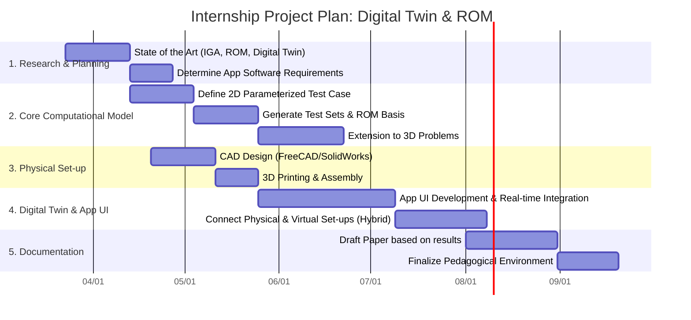

# Digital Twin & Reduced Order Modelling for Nonlinear Dynamics

**Supervisor:** Christophe Hoareau (EPN04, Cnam)  
**Duration:** < 6 Months  
**Objective:** Create a pedagogical "Digital Twin" set-up for FSI / Non-Linear courses, combining a physical 3D-printed model with a real-time virtual environment. 

## 📌 Project Overview
The Équipement pour la Performance et le Numerique (EPN04) department is dedicated to advancing engineering performance through numerical methods and advanced simulation techniques. This project bridges structural mechanics and interactive software by focusing on reduced order modelling of nonlinear dynamic problems with geometrical parameters. 

The main objective is to propose a methodology and validate a reduced order model strategy to solve nonlinear dynamic problems with large displacements of structures. The originality of the core research consists in using Isogeometric Analysis (IGA) and hyper-reduction techniques to construct the reduced order models (ROM).

## 📅 Project Timeline (Gantt Chart)

