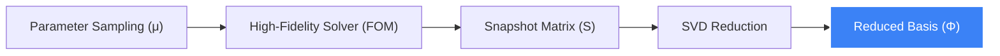

# <i class="fa-solid fa-layer-group"></i> Project Architecture: Phase 2

> [!NOTE]
> This document outlines the technical workflow for the transition from **1D Prototypes** to **2D/3D Reduced Order Models (ROM)**. It bridges the gap between high-fidelity solvers and real-time Digital Twins.

---

## <i class="fa-solid fa-hammer"></i> 1. The Offline Forge (Training Phase)

In the offline phase, we generate the "mathematical DNA" of our system. This is where high-fidelity simulations ($FOM$) are condensed into a low-dimensional manifold.

### High-Fidelity Infrastructure
- **Solver**: [Nutils](https://nutils.org/) (Python-based IGA) or supervisor-provided lab code.
- **Physics**: Geometrically nonlinear elasticity (Saint Venant-Kirchhoff).
- **Sampling**: $100+$ snapshots generated via **Latin Hypercube Sampling (LHS)**.

### Reduced Basis Extraction
We apply **Proper Orthogonal Decomposition (POD)** to the snapshot matrix $\mathbf{S}$:
$$ \mathbf{S} = [\mathbf{u}(\mu_1), \dots, \mathbf{u}(\mu_n)] $$
Using SVD, we find the reduced basis $\mathbf{\Phi}$ that captures $99.9\%$ of the system energy.

---

## <i class="fa-solid fa-bolt"></i> 2. The Online Engine (Real-Time Phase)

The online phase runs in the **Digital Twin frontend**. Instead of solving $1000+$ DOF equations, we solve a projected system of size $r \approx 10$.

### Galerkin Projection
The full stiffness matrix $\mathbf{K}$ is projected onto the reduced basis:
$$ \mathbf{K}_{red} = \mathbf{\Phi}^T \mathbf{K} \mathbf{\Phi} $$

### Performance Target
| Metric | Full Model (FOM) | Reduced Model (ROM) |
| :--- | :--- | :--- |
| **System Size** | $2000 \times 2000$ | $10 \times 10$ |
| **Solve Time** | $~2$ seconds | **$< 10$ milliseconds** |
| **Memory** | $\approx 50$ MB | $\approx 10$ KB |

---

## <i class="fa-solid fa-code-branch"></i> 3. Integration & Deployment

- **Data Export**: Offline results are serialized to **portable .npy or .json** formats.
- **Web Runtime**: JavaScript/WebAssembly core implementing the online query loop.
- **Visualization**: Three.js for 3D deformation shapes rendering at **60fps**.

> [!TIP]
> Hyper-reduction (ECSW/ECM) will be used to handle nonlinear terms efficiently, ensuring that even under extreme deformations, the Digital Twin remains responsive.
